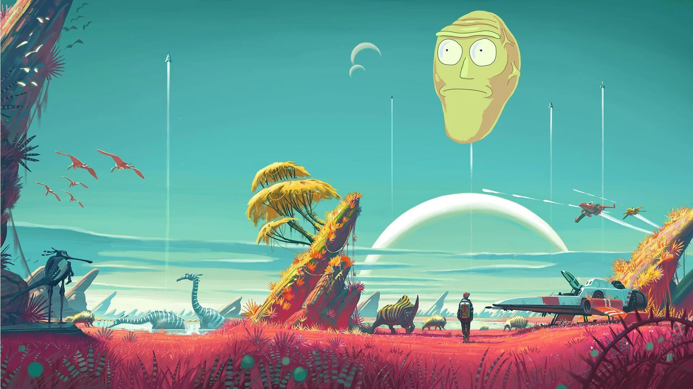

# BrubsLabs

## Show Me What You Got!

BrubsLabs is a vibrant, Rick and Morty-inspired platform where creators can share their side projects, creative ideas, and innovative designs with the universe.

## About

BrubsLabs celebrates the concept of a "Brub" - a fun project that represents your creativity without the constraints of deadlines or strict requirements. It's a space for makers, thinkers, and innovators to showcase what they've got!

## Tech Stack

- HTML5
- CSS3
- JavaScript

## Contributing

Got a cool idea for BrubsLabs? Show us what you got! Submit a pull request or open an issue to discuss new features.

*Created with cosmic inspiration. BrubsLabs - A Dimension C-137 Creation.*